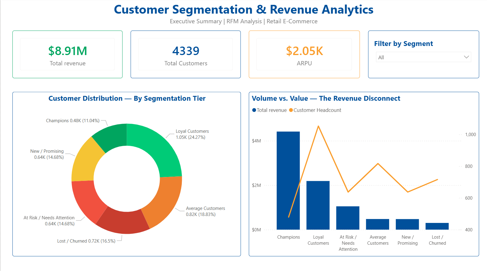

# 📊 Customer Segmentation & Revenue Analytics Engine

## 📌 Executive Summary
This project engineers a robust **Recency, Frequency, and Monetary (RFM) model** to segment an e-commerce customer base. By building an automated data pipeline, this analytical engine transforms raw transactional data into a strategic Business Intelligence application, designed to identify high-value "Champions" and isolate forecasted revenue at risk from churning users.

<div align="center">
  
</div>

> **Note:** A high-resolution, distributable PDF version of this dashboard (`rfm-revenue-analytics.pdf`) is available in the [`/images`](images/) directory for portfolio review.

---

## 🏗️ The Architecture & Tech Stack
This project transitions away from basic demographic assumptions and segments customers purely through behavioral data engineering and mathematical modeling.

* **Python (Data Ingestion):** Used to programmatically ingest, clean, and stage raw Kaggle e-commerce datasets into the analytics environment.
* **SQL (BigQuery):** The core modeling engine. Utilized advanced window functions, CTEs, and aggregations to calculate Recency, Frequency, and Monetary values, assigning dynamic 1-5 tier scores to build the composite RFM matrix.
* **Power BI (Data Visualization):** Developed an enterprise-grade UI featuring DAX measure branching, semantic color grading, and dynamic cross-filtering to translate database queries into an interactive executive tool.

---

## 📂 Repository Structure

The project is structured to mirror a production-grade data engineering workspace. *(Note: Raw CSV data and Google Cloud JSON credentials are intentionally git-ignored for security).*

```text
├── dashboard/                  # Power BI interactive application (.pbix)
├── images/                     # UI snapshots and PDF portfolio exports
├── python/                     # Python ingestion and data staging scripts
├── sql/                        # Analytical BigQuery modeling and RFM scoring logic
├── .gitignore                  # Security guardrails for credentials and heavy data
└── README.md                   # Executive summary and documentation
```
📈 Key Business Insights Discovered
Total Portfolio Value: Analyzed 4,339 unique customers generating $8.91M in total revenue, establishing a baseline Average Revenue Per User (ARPU) of $2.05K.

The Revenue Disconnect: Revealed a stark volume-to-value contrast. The "Champions" tier represents a much smaller headcount than the "Loyal" tier, yet drastically outpaces them in raw revenue generation, proving the Pareto principle within the customer base.

At-Risk Capital: Identified a critical mass of users slipping into the "At Risk / Needs Attention" and "Lost / Churned" segments, isolating the exact financial liability the retention marketing team needs to target to prevent revenue leakage.

## 🤖 Phase 2: Predictive Machine Learning (Churn Forecasting)
Transitioning from descriptive to predictive analytics, this project utilizes the engineered RFM metrics to train a **Random Forest Classifier** designed to catch churning customers before they leave.

* **Algorithmic Approach:** Purposely excluded the `Recency` variable to prevent target leakage, forcing the model to predict churn risk strictly based on purchasing habits (`Frequency`, `Monetary`, and an engineered `Average Order Value` feature).
* **Handling Imbalanced Data:** Applied balanced class weights to penalize false negatives, successfully increasing the model's **Recall to 80%** for the churn class—prioritizing the business goal of catching at-risk customers over raw precision.
* **Feature Importance & Strategy:** The model mathematically proved that **Purchase Frequency (46.7%)** is a significantly stronger indicator of loyalty than **Total Monetary Spend (39.4%)**. This translates to a direct business recommendation: pivot marketing spend away from generic discounts and toward subscription or punch-card models to artificially drive repeat visits.

🚀 How to Run This Project

0. Prerequisites: Download the raw e-commerce dataset from Kaggle and place it in the /raw_data directory. Ensure your Google Cloud / BigQuery credentials.json file is securely placed in the root directory (ensure it matches the .gitignore rules).

1. Database Setup: Execute the Python script in /python to ingest, clean, and load the raw .csv into your BigQuery environment.

2. Data Modeling: Run the .sql scripts located in the /sql directory to execute the window functions and generate the final RFM scoring views.

3. Visualization: Open the .pbix file in /dashboard using Power BI Desktop. Update the Data Source settings to point to your specific BigQuery project ID to refresh the visuals.